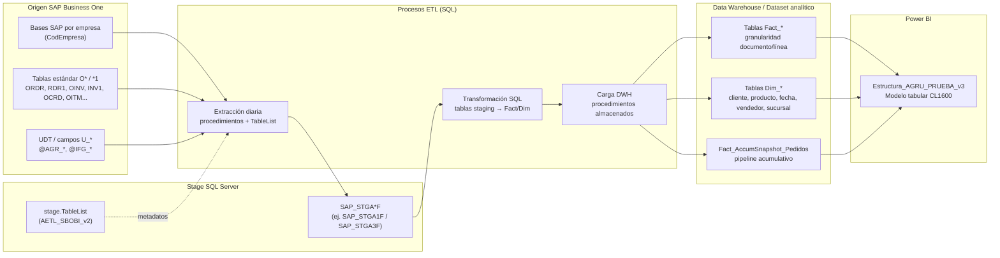

# Documentación Técnica — Estructura_AGRU_PRUEBA_v3

**Proyecto:** CASHFLOW RENDIMIENTO / AGRUCAPERS  
**Informe Power BI:** `Estructura_AGRU_PRUEBA_v3`  
**Fecha de documentación:** 18/05/2026  
**Fuentes analizadas:** modelo semántico conectado (Power BI Desktop), `SAP_STGA1F.sql`, `table_list_24_04_26.sql`, `INSTRUCCIONES_TABLELIST_UPDATE_INSERT.txt`

**Anexos de este paquete documental:**

| Archivo | Contenido |
|---------|-----------|
| `ANEXO_CATALOGO_TABLELIST.md` | 106 tablas SAP en `stage.TableList` con columnas por dominio |
| `ANEXO_DICCIONARIO_COLUMNAS.md` | Diccionario completo de columnas Fact_* y Dim_* del modelo |
| `ANEXO_MEDIDAS_DAX.md` | Catálogo de las 111 medidas con expresiones DAX completas |

**Parámetros operativos confirmados:** carga **diaria**; ETL implementado en **SQL Server** (tablas + procedimientos almacenados). No se documenta nombre de servidor.

---

## 1. Documentación Técnica

### 1.1 Arquitectura de Datos

#### Diagrama de alto nivel



#### Capas y responsabilidades

| Capa | Componente | Descripción |
|------|------------|-------------|
| **Origen** | SAP B1 | ERP operacional. Documentos de venta/compra, maestros (clientes, artículos, almacenes) y tablas de usuario. |
| **Stage por empresa** | `SAP_STGA*F.dbo.*` | Réplica estructural por `CodEmpresa` (script DDL: `SAP_STGA1F.sql`, referencia operativa `SAP_STGA3F` en cabecera). ~115 tablas definidas. |
| **Metadatos ETL** | `AETL_SBOBI_v2.stage.TableList` | Catálogo de tablas/columnas a extraer (`SourceColumns` = `DestinationColumns`). Plantilla `CodEmpresa = -1`. |
| **Transformación / carga** | Procedimientos y tablas SQL | Lógica de negocio (renombres, claves compuestas, flags de pipeline, márgenes) en capa SQL entre stage y tablas analíticas. |
| **DWH / Dataset** | Tablas `Fact_*` y `Dim_*` | Modelo dimensional orientado a análisis comercial, logístico y de cashflow/rendimiento. |
| **Consumo** | Power BI Desktop | Informe `Estructura_AGRU_PRUEBA_v3`: 31 tablas, 111 medidas, 62 relaciones, compatibilidad 1600. |

**Frecuencia:** ejecución **diaria** del ciclo completo (extracción SAP → stage → DWH → refresh Power BI).

**Herramienta ETL:** **SQL Server** — orquestación mediante **procedimientos almacenados** y tablas intermedias (no SSIS/ADF en el alcance documentado del repositorio).

---

### 1.2 Modelo de Datos

#### Enfoque

Modelo **dimensional Kimball** con:

- Hechos **transaccionales** a nivel de línea de documento SAP.
- Hecho **Accumulating Snapshot** para el ciclo pedido → entrega → factura → cobro.
- Dimensiones conformadas compartidas.
- Trazabilidad entre documentos mediante claves compuestas (`Pedido_Line_Key`, `Albaran_Line_Key`, `Acuerdo_Line_Key`) y campos `DocOrigen_*` / `BaseEntry` / `BaseType` de SAP.

#### Tablas de hechos (por documento SAP)

| Tabla Power BI | Granularidad | Origen SAP (cabecera + líneas) | ObjType SAP |
|--------------|--------------|--------------------------------|-------------|
| `Fact_Pedidos_Lineas` | 1 fila / línea pedido | ORDR + RDR1 | 17 |
| `Fact_Albaranes_Lineas` | 1 fila / línea albarán | ODLN + DLN1 | 15 |
| `Fact_Facturas_Lineas` | 1 fila / línea factura | OINV + INV1 | 13 |
| `Fact_Ofertas_Lineas` | 1 fila / línea oferta | OQUT + QUT1 | 23 |
| `Fact_AcuerdosGlobales_Lineas` | 1 fila / línea acuerdo | OOAT + OAT1 | — |
| `Fact_Devoluciones_Lineas` | 1 fila / línea devolución | ORDN + RDN1 | 16 |
| `Fact_Abonos_Lineas` | 1 fila / línea abono | ORIN + RIN1 | 14 |
| `Fact_Solicitudes_Devolucion_Lineas` | 1 fila / línea solicitud | ORRR + RRR1 | — |
| `Fact_PedidosCompra_Lineas` | 1 fila / línea pedido compra | OPOR + POR1 | 22 |
| `Fact_Inventario_Almacen` | 1 fila / artículo-almacén | OITW + OITM | — |
| **`Fact_AccumSnapshot_Pedidos`** | **1 fila / pedido (cabecera)** | Derivado ORDR + hitos | 17 |

#### Tablas de dimensiones

| Tabla | Origen SAP | Clave natural |
|-------|------------|---------------|
| `Dim_Cliente` | OCRD | `CardCode` |
| `Dim_Vendedor` | OSLP | `SlpCode` |
| `Dim_Producto` | OITM (+ atributos U_AGR_*) | `ItemCode` |
| `Dim_Fecha` | Calendario generado | `Date` |
| `Dim_Sucursal` | OBPL | `Id_Sucursal` (BPLId) |

#### Tabla de trazabilidad y soporte

| Elemento | Función |
|----------|---------|
| `Pedido_Line_Key` | `FORMAT(DocEntry,"0") & "_" & FORMAT(LineNum,"0")` — enlace pedido ↔ albarán ↔ factura. |
| `Albaran_Line_Key` | Clave compuesta análoga en entregas. |
| `Acuerdo_Line_Key` / `Acuerdo_Line_Key_Ref` | Enlace acuerdos globales ↔ líneas de pedido. |
| `DocOrigen_Entry` + `DocOrigen_ObjectType` | Documento SAP origen (ej. oferta 23 → pedido 17). |
| `Tabla_Filtro_Cobertura` | Tabla desconectada para filtro visual de cobertura de stock. |
| `LocalDateTable_*` | Tablas de fecha automáticas (Power BI) para columnas de fecha secundarias. |

#### Definición de relaciones

**Patrón general:** `Many` (hecho) → `One` (dimensión), filtro **unidireccional** (de dimensión a hecho).

##### Relaciones activas principales (Dim_Fecha role-playing en snapshot)

| Relación | Desde | Hacia | Cardinalidad | Activa | Uso |
|----------|-------|-------|--------------|--------|-----|
| `Fact_FechaEntrega_Dim_Fecha` | `Fact_AccumSnapshot_Pedidos[Fecha_Entrega]` | `Dim_Fecha[Date]` | M:1 | **Sí** | Fecha principal del snapshot |
| `Fact_FechaFactura_Dim_Fecha` | `Fecha_Factura` | `Dim_Fecha` | M:1 | No | `USERELATIONSHIP` en DAX |
| `Fact_FechaCobro_Dim_Fecha` | `Fecha_Cobro` | `Dim_Fecha` | M:1 | No | `USERELATIONSHIP` en DAX |
| `Fact_CardCode_Dim_Cliente` | `CardCode` | `Dim_Cliente` | M:1 | Sí | Cliente |
| `Fact_SlpCode_Dim_Vendedor` | `SlpCode` | `Dim_Vendedor` | M:1 | Sí | Vendedor |

##### Catálogo completo de relaciones (62)

| # | Nombre | Desde | Columna | Hacia | Columna | Activa | Filtro |
|---|--------|-------|---------|-------|---------|--------|--------|
| 1 | Fact_FechaEntrega_Dim_Fecha | Fact_AccumSnapshot_Pedidos | Fecha_Entrega | Dim_Fecha | Date | Sí | Unidireccional |
| 2 | Fact_FechaFactura_Dim_Fecha | Fact_AccumSnapshot_Pedidos | Fecha_Factura | Dim_Fecha | Date | No | Unidireccional |
| 3 | Fact_FechaCobro_Dim_Fecha | Fact_AccumSnapshot_Pedidos | Fecha_Cobro | Dim_Fecha | Date | No | Unidireccional |
| 4 | Fact_CardCode_Dim_Cliente | Fact_AccumSnapshot_Pedidos | CardCode | Dim_Cliente | CardCode | Sí | Unidireccional |
| 5 | Fact_SlpCode_Dim_Vendedor | Fact_AccumSnapshot_Pedidos | SlpCode | Dim_Vendedor | SlpCode | Sí | Unidireccional |
| 6 | FPL_CardCode_DimCliente | Fact_Pedidos_Lineas | CardCode | Dim_Cliente | CardCode | No | Unidireccional |
| 7 | FPL_SlpCode_DimVendedor | Fact_Pedidos_Lineas | SlpCode | Dim_Vendedor | SlpCode | No | Unidireccional |
| 8 | FPL_FechaPedido_DimFecha | Fact_Pedidos_Lineas | Fecha_Pedido | Dim_Fecha | Date | No | Unidireccional |
| 9 | FAL_CardCode_DimCliente | Fact_Albaranes_Lineas | CardCode | Dim_Cliente | CardCode | Sí | Unidireccional |
| 10 | FAL_SlpCode_DimVendedor | Fact_Albaranes_Lineas | SlpCode | Dim_Vendedor | SlpCode | Sí | Unidireccional |
| 11 | FAL_FechaAlbaran_DimFecha | Fact_Albaranes_Lineas | Fecha_Albaran | Dim_Fecha | Date | Sí | Unidireccional |
| 12 | FPL_ItemCode_DimProducto | Fact_Pedidos_Lineas | ItemCode | Dim_Producto | ItemCode | Sí | Unidireccional |
| 13 | FAL_ItemCode_DimProducto | Fact_Albaranes_Lineas | ItemCode | Dim_Producto | ItemCode | Sí | Unidireccional |
| 14 | FFL_CardCode_DimCliente | Fact_Facturas_Lineas | CardCode | Dim_Cliente | CardCode | Sí | Unidireccional |
| 15 | FFL_SlpCode_DimVendedor | Fact_Facturas_Lineas | SlpCode | Dim_Vendedor | SlpCode | Sí | Unidireccional |
| 16 | FFL_ItemCode_DimProducto | Fact_Facturas_Lineas | ItemCode | Dim_Producto | ItemCode | Sí | Unidireccional |
| 17 | FFL_FechaFactura_DimFecha | Fact_Facturas_Lineas | Fecha_Factura | Dim_Fecha | Date | Sí | Unidireccional |
| 18 | FOL_CardCode_DimCliente | Fact_Ofertas_Lineas | CardCode | Dim_Cliente | CardCode | Sí | Unidireccional |
| 19 | FOL_SlpCode_DimVendedor | Fact_Ofertas_Lineas | SlpCode | Dim_Vendedor | SlpCode | Sí | Unidireccional |
| 20 | FOL_ItemCode_DimProducto | Fact_Ofertas_Lineas | ItemCode | Dim_Producto | ItemCode | Sí | Unidireccional |
| 21 | FOL_FechaOferta_DimFecha | Fact_Ofertas_Lineas | Fecha_Oferta | Dim_Fecha | Date | Sí | Unidireccional |
| 22 | FAG_CardCode_DimCliente | Fact_AcuerdosGlobales_Lineas | CardCode | Dim_Cliente | CardCode | Sí | Unidireccional |
| 23 | FAG_ItemCode_DimProducto | Fact_AcuerdosGlobales_Lineas | ItemCode | Dim_Producto | ItemCode | Sí | Unidireccional |
| 24 | FAG_FechaInicio_DimFecha | Fact_AcuerdosGlobales_Lineas | Fecha_Inicio | Dim_Fecha | Date | Sí | Unidireccional |
| 25 | FDV_CardCode_DimCliente | Fact_Devoluciones_Lineas | CardCode | Dim_Cliente | CardCode | Sí | Unidireccional |
| 26 | FDV_SlpCode_DimVendedor | Fact_Devoluciones_Lineas | SlpCode | Dim_Vendedor | SlpCode | Sí | Unidireccional |
| 27 | FDV_ItemCode_DimProducto | Fact_Devoluciones_Lineas | ItemCode | Dim_Producto | ItemCode | Sí | Unidireccional |
| 28 | FDV_FechaDevolucion_DimFecha | Fact_Devoluciones_Lineas | Fecha_Devolucion | Dim_Fecha | Date | Sí | Unidireccional |
| 29 | FAB_CardCode_DimCliente | Fact_Abonos_Lineas | CardCode | Dim_Cliente | CardCode | Sí | Unidireccional |
| 30 | FAB_SlpCode_DimVendedor | Fact_Abonos_Lineas | SlpCode | Dim_Vendedor | SlpCode | Sí | Unidireccional |
| 31 | FAB_ItemCode_DimProducto | Fact_Abonos_Lineas | ItemCode | Dim_Producto | ItemCode | Sí | Unidireccional |
| 32 | FAB_FechaAbono_DimFecha | Fact_Abonos_Lineas | Fecha_Abono | Dim_Fecha | Date | Sí | Unidireccional |
| 33 | FPC_CardProv_DimCliente | Fact_PedidosCompra_Lineas | CardCode_Proveedor | Dim_Cliente | CardCode | Sí | Unidireccional |
| 34 | FPC_ItemCode_DimProducto | Fact_PedidosCompra_Lineas | ItemCode | Dim_Producto | ItemCode | Sí | Unidireccional |
| 35 | FPC_FechaPedidoCompra_DimFecha | Fact_PedidosCompra_Lineas | Fecha_Pedido_Compra | Dim_Fecha | Date | Sí | Unidireccional |
| 36 | FINV_ItemCode_DimProducto | Fact_Inventario_Almacen | ItemCode | Dim_Producto | ItemCode | Sí | Unidireccional |
| 37–41 | DimSucursal_* | Varios hechos | Id_Sucursal | Dim_Sucursal | Id_Sucursal | Sí | Unidireccional |
| 42–45 | FSDL_* | Fact_Solicitudes_Devolucion_Lineas | CardCode/SlpCode/ItemCode/Fecha_Solicitud | Dim_* | — | Sí | Unidireccional |
| 46–61 | LocalDateTable_* | Fechas secundarias en hechos | varias | LocalDateTable_* | Date | Sí | Unidireccional (DatePartOnly) |
| 62 | bcddb2ac-… | Fact_Pedidos_Lineas | DocEntry | Fact_AccumSnapshot_Pedidos | DocEntry | Sí | Unidireccional |

> Relaciones 37–41: `Fact_Ofertas_Lineas`, `Fact_Devoluciones_Lineas`, `Fact_Abonos_Lineas`, `Fact_PedidosCompra_Lineas`, `Fact_Solicitudes_Devolucion_Lineas`, `Fact_Pedidos_Lineas`, `Fact_Albaranes_Lineas`, `Fact_Facturas_Lineas` → `Dim_Sucursal`.

**Claves de unión:**

- Cliente / vendedor / producto: códigos SAP (`CardCode`, `SlpCode`, `ItemCode`).
- Sucursal: `Id_Sucursal` ← `BPLId` en cabeceras de documento.
- Fechas: columnas `datetime` normalizadas en hechos → `Dim_Fecha[Date]`.

---

### 1.3 Diccionario de Datos

> **Diccionario completo:** todas las columnas de tablas `Fact_*` y `Dim_*` (tipo, origen SAP, descripción) en `ANEXO_DICCIONARIO_COLUMNAS.md`. A continuación, convenciones y extractos representativos.

#### Convenciones de normalización

| Convención | Ejemplo SAP | Campo modelo |
|------------|-------------|--------------|
| Prefijo `Fecha_` | `DocDate`, `DocDueDate` | `Fecha_Pedido`, `Fecha_Vencimiento` |
| Importes en moneda documento | `LineTotal` | `Importe_Linea` |
| Cantidades | `Quantity`, `OpenQty` | `Cantidad`, `Cantidad_Pendiente` |
| Estado línea | `LineStatus` O/C | `Estado_Linea` |
| Claves compuestas trazabilidad | `DocEntry`+`LineNum` | `Pedido_Line_Key` |
| Flags pipeline | Calculados en ETL/DAX | `Flag_Entregado`, `Flag_Facturado`, `Flag_Cobrado` |

#### Diccionario resumido — `Fact_Pedidos_Lineas` (muestra representativa)

| Campo | Tipo PBI | Descripción funcional | Origen SAP |
|-------|----------|----------------------|------------|
| `DocEntry` | Int64 | ID interno pedido | ORDR.DocEntry |
| `LineNum` | Int64 | Número de línea | RDR1.LineNum |
| `DocNum` | Int64 | Número visible pedido | ORDR.DocNum |
| `CardCode` | String | Cliente | ORDR.CardCode |
| `SlpCode` | Int64 | Vendedor | ORDR.SlpCode |
| `Fecha_Pedido` | DateTime | Fecha documento | ORDR.DocDate |
| `ItemCode` | String | Artículo | RDR1.ItemCode |
| `Cantidad` | Double | Cantidad pedida | RDR1.Quantity |
| `Cantidad_Pendiente` | Double | Pendiente de servir | RDR1.OpenQty |
| `Cantidad_Cumplida` | Double | Cantidad cumplida SAP | Derivado entregas |
| `Importe_Linea` | Double | Importe línea | RDR1.LineTotal |
| `Importe_Coste` / `Margen_Bruto` | Double | Rentabilidad | INMPrice / coste estándar |
| `Almacen` | String | Almacén línea | RDR1.WhsCode |
| `Pedido_Line_Key` | String (calculada) | Clave trazabilidad | DAX: DocEntry_LineNum |
| `Id_Sucursal` | Int64 | Sucursal BPL | ORDR.BPLId |
| `DocOrigen_ObjectType` | Int64 | Tipo doc. origen | RDR1.BaseType / cabecera |
| `Acuerdo_Line_Key_Ref` | String | Enlace acuerdo global | AgrNo, AgrLnNum, OOAT |

#### Diccionario resumido — `Fact_AccumSnapshot_Pedidos` (pipeline)

| Campo | Tipo | Descripción | Origen / lógica |
|-------|------|-------------|-----------------|
| `DocEntry` | Int64 | PK pedido | ORDR |
| `Importe_Pedido` | Double | Importe total pedido | ORDR.DocTotal / suma líneas |
| `Importe_Facturado` | Double | Importe facturado acumulado | Agregación OINV |
| `Importe_Cobrado` | Double | Importe cobrado | ORCT / pagos |
| `Fecha_Pedido` | DateTime | Alta pedido | ORDR.DocDate |
| `Fecha_Entrega` | DateTime | Primera entrega | MIN(ODLN.DocDate) |
| `Fecha_Factura` | DateTime | Primera factura | MIN(OINV.DocDate) |
| `Fecha_Cobro` | DateTime | Cobro | Pagos asociados |
| `Dias_Pedido_a_Entrega` | Int64 | Lead time entrega | DATEDIFF |
| `Dias_Entrega_a_Factura` | Int64 | Lead time facturación | DATEDIFF |
| `Dias_Factura_a_Cobro` | Int64 | DSO parcial | DATEDIFF |
| `Dias_Ciclo_Acumulado` | Int64 | Ciclo completo | Suma hitos |
| `Etapa_Actual` | String | 1-Pedido … 4-Cobrado | Reglas de negocio |
| `Flag_Entregado` / `Flag_Facturado` / `Flag_Cobrado` | Int | Hitos binarios | ETL/DAX |
| `Cancelado` | String | Y/N | ORDR.CANCELED |

#### Diccionario resumido — dimensiones

| Tabla | Campos clave | Origen |
|-------|---------------|--------|
| `Dim_Cliente` | CardCode, CardName, GroupCode, territorio, U_AGR_COMERCIALTECNICO | OCRD |
| `Dim_Vendedor` | SlpCode, SlpName | OSLP |
| `Dim_Producto` | ItemCode, ItemName, U_AGR_CATEGORIA, U_AGR_AREA, atributos producto | OITM |
| `Dim_Fecha` | Date, Año, Trimestre, Mes, Semana | Calendario |
| `Dim_Sucursal` | Id_Sucursal, nombre sucursal | OBPL |

#### Catálogo Stage — tablas SAP en `TableList` (106 entradas, plantilla CodEmpresa=-1)

Agrupación por dominio (tablas destino `dbo` en stage):

| Dominio | Tablas (ejemplos) |
|---------|-------------------|
| **Ventas — cabeceras** | ORDR, ODLN, OINV, OQUT, ORDN, ORIN, ORRR, OPOR |
| **Ventas — líneas** | RDR1, DLN1, INV1, QUT1, RDN1, RIN1, RRR1, POR1 |
| **Maestros** | OCRD, OITM, OITW, OSLP, OBPL, OITB, OWHS, OCRG |
| **Acuerdos / ofertas** | OOAT, OAT1 |
| **Finanzas / cobros** | ORCT, RCT2, OBOE, INV6, RIN6 |
| **Inventario / costes** | OINM, @IFG_PMC, @IFG_COSTESVENTA_* |
| **Producción** | OWOR, WOR1, OITT, ITT1 |
| **UDT AGR** | @AGR_COMERCIALTEC, @AGR_TIPOPRODUCCION, @AGR_LINEAPRODUCCION |

Referencia completa de columnas SAP en stage: `ANEXO_CATALOGO_TABLELIST.md`, `table_list_24_04_26.sql` e `INSTRUCCIONES_TABLELIST_UPDATE_INSERT.txt`.

---

### 1.4 Procesos ETL

#### Resumen operativo

| Parámetro | Valor |
|-----------|-------|
| **Frecuencia** | Diaria |
| **Herramienta** | SQL Server (tablas + procedimientos almacenados) |
| **Metadatos de extracción** | `AETL_SBOBI_v2.stage.TableList` |
| **Stage por empresa** | `SAP_STGA*F.dbo.*` + `CodEmpresa` |
| **Destino analítico** | Tablas `Fact_*`, `Dim_*` |
| **Consumo** | Power BI `Estructura_AGRU_PRUEBA_v3` |

#### Flujo de carga (diario)

```
SAP B1 (por CodEmpresa)
    │
    ▼ ① Extracción (SQL)
    │   • Procedimiento(s) leen stage.TableList
    │   • SourceColumns / DestinationColumns (lista blanca)
    │   • CompleteLoad=1 en plantilla (carga completa por tabla configurada)
    │
    ▼ ② Stage
    │   • SAP_STGA*F.dbo.<TablaSAP> (+ CodEmpresa)
    │   • DDL de referencia: SAP_STGA1F.sql
    │
    ▼ ③ Transformación y carga DWH (SQL)
    │   • Procedimientos: join cabecera+línea, renombres Fact_/Dim_
    │   • Claves: Pedido_Line_Key, Albaran_Line_Key, Acuerdo_Line_Key
    │   • Snapshot: agregación pipeline pedido→entrega→factura→cobro
    │   • Flags: Flag_Entregado, Flag_Facturado, Flag_Cobrado, Etapa_Actual
    │
    ▼ ④ Tablas analíticas
    │   • Fact_* / Dim_* listas para importación o vista en Power BI
    │
    ▼ ⑤ Power BI
        • Refresh del dataset + 111 medidas DAX en el modelo
```

#### Reglas de negocio aplicadas (inferidas del modelo)

| Regla | Implementación |
|-------|----------------|
| Exclusión pedidos cancelados | `Cancelado <> "Y"` en medidas de volumen activo |
| Pipeline por hitos | `Etapa_Actual`: 1-Pedido → 2-Entregado → 3-Facturado → 4-Cobrado |
| OTIF | Entrega con `Dias_Retraso_Entrega <= 0` |
| Trazabilidad línea | `Pedido_Line_Key` enlaza RDR1 → DLN1 → INV1 |
| ObjectType estándar B1 | 17 pedido, 15 entrega, 13 factura, 23 oferta, 16 devolución, 14 abono |
| Role-playing fechas | Relaciones inactivas + `USERELATIONSHIP` en medidas de snapshot |
| Acuerdos globales | `TREATAS` entre `Acuerdo_Line_Key` y `Acuerdo_Line_Key_Ref` |
| Stock servible | `OITW.OnHand` / comprometidos → `Stock_Neta_Servible` |

#### Parámetros TableList (metadatos)

| Parámetro | Valor en plantilla | Interpretación |
|-----------|-------------------|----------------|
| `CompleteLoad` | `1` | Carga completa de la tabla en cada ejecución diaria |
| `MonthsBack` | `NULL` | Sin ventana incremental por metadatos; el filtro temporal, si existe, está en los procedimientos SQL |
| `DateSourceField` / `DateDestinationField` | `NULL` en muchas filas | Incremental por fecha no declarado en TableList para esas tablas |

#### Orden de ejecución recomendado (dependencias lógicas)

1. Maestros: `OBPL`, `OCRD`, `OITM`, `OSLP`, `OITW`, UDT `@AGR_*`
2. Documentos de venta/compra: cabeceras antes que líneas (`ORDR`→`RDR1`, `ODLN`→`DLN1`, etc.)
3. Finanzas: `OINV`, `ORCT`, `INV6` (cobros y vencimientos)
4. Construcción `Fact_AccumSnapshot_Pedidos` tras hechos de pedido, entrega, factura y cobro
5. Refresh Power BI

#### Dependencias

| Dependencia | Detalle |
|-------------|---------|
| `stage.TableList` | Debe existir fila por tabla con `SourceColumns` alineados al DDL stage |
| DDL stage | Columnas en `SAP_STGA*F` deben existir antes de la carga (ver `SAP_STGA1F.sql`) |
| OBPL / BPLId | Nueva sucursal: INSERT en TableList (instrucciones sección 4) |
| Actualización columnas | UPDATE incremental (instrucciones sección 5) o redeploy `table_list_24_04_26.sql` |
| Orden de carga | Maestros (OCRD, OITM, OSLP, OBPL) antes que transaccionales |
| Power BI | Refresh del dataset tras finalizar ETL |

#### Mantenimiento del catálogo TableList

1. Backup / transacción.
2. INSERT si nueva tabla (ej. `OBPL`).
3. UPDATE `SourceColumns` y `DestinationColumns` (mismos valores, orden idéntico).
4. Validar `@@ROWCOUNT = 1` por tabla.
5. Verificar DDL destino antes de la siguiente ejecución ETL.

---

## 2. Medidas definidas actualmente

**Total:** 111 medidas en 7 tablas de hechos. **Catálogo completo con expresiones DAX:** ver `ANEXO_MEDIDAS_DAX.md`.

### 2.1 `Fact_AccumSnapshot_Pedidos` (37 medidas)

| Carpeta | Medida | Descripción |
|---------|--------|-------------|
| Volumen | `# Pedidos` | Número total de pedidos |
| Volumen | `# Pedidos Activos` | Pedidos no cancelados |
| Volumen | `# Entregados` | Hito entrega |
| Volumen | `# Facturados` | Hito factura |
| Volumen | `# Cobrados` | Hito cobro |
| Eficacia Pipeline | `% Tasa Entrega` | Entregados / activos |
| Eficacia Pipeline | `% Tasa Facturacion` | Facturados / activos |
| Eficacia Pipeline | `% Tasa Cobro` | Cobrados / activos |
| Eficacia Pipeline | `# Entregas a Tiempo` | Retraso ≤ 0 |
| Eficacia Pipeline | `% OTIF (On Time In Full)` | OTIF sobre entregados |
| Importes | `Importe Total Pedido` | Suma importe pedido |
| Importes | `Importe Total Facturado` | Suma facturado |
| Importes | `Importe Total Cobrado` | Suma cobrado |
| Importes | `Importe Pendiente Cobrar` | Facturado − cobrado |
| Importes | `% Conversion Factura-Cobro` | Cobrado / facturado |
| Tiempos de Ciclo | `Avg Dias Pedido a Entrega` | Lead time pedido→entrega |
| Tiempos de Ciclo | `Avg Dias Entrega a Factura` | Lead time entrega→factura |
| Tiempos de Ciclo | `Avg Dias Factura a Cobro` | DSO |
| Tiempos de Ciclo | `Avg Ciclo Total` | Pedido→cobro (completados) |
| Tiempos de Ciclo | `Avg Retraso Entrega` | vs fecha solicitada |
| Tiempos de Ciclo | `Max Dias Ciclo Acumulado` | Outliers |
| Pipeline | `Importe Pedidos por Etapa` | Por etapa pipeline |
| Pipeline | `# Pedidos En Curso` | Activos no cobrados |
| Pipeline | `Importe x Etapa Pedido` | Etapa 1-Pedido |
| Pipeline | `Importe x Etapa Entregado` | Etapa 2-Entregado |
| Pipeline | `Importe x Etapa Facturado` | Etapa 3-Facturado |
| Pipeline | `Importe x Etapa Cobrado` | Etapa 4-Cobrado |
| Role-Playing Fechas | `Importe por Fecha Entrega` | USERELATIONSHIP entrega |
| Role-Playing Fechas | `Importe por Fecha Factura` | USERELATIONSHIP factura |
| Role-Playing Fechas | `Importe por Fecha Cobro` | USERELATIONSHIP cobro |
| Role-Playing Fechas | `Pedidos Entregados por Fecha Entrega` | Recuento por fecha entrega |
| Role-Playing Fechas | `Pedidos Cobrados por Fecha Cobro` | Recuento por fecha cobro |
| Acumulados | `Snapshot Pedidos Acumulado` | YTD recuento |
| Acumulados | `Importe Pedido Acumulado YTD` | YTD importe pedido |
| Acumulados | `Importe Cobrado Acumulado YTD` | YTD cobrado |
| Visuales comerciales | `Importe Pendiente Facturacion Pedido` | Pedido − facturado cabecera |
| Trazabilidad pedido | `Etiqueta Estado Facturacion Pedido` | Sin facturar / parcial / facturado |

### 2.2 `Fact_Pedidos_Lineas` (34 medidas)

| Carpeta | Medida |
|---------|--------|
| Volumen | `# Lineas Pedido`, `# Pedidos Distintos` |
| Cantidades | `Cantidad Pedida`, `Cantidad Pendiente` |
| Importes | `Importe Pedido Lineas` |
| Ratios | `% Cumplimiento Lineas` |
| Rentabilidad | `Importe Coste Pedidos`, `Margen Bruto Pedidos`, `% Margen Bruto Pedidos` |
| Descuentos | `Importe Descuento Pedidos`, `% Descuento Medio Pedidos` |
| IVA | `Importe IVA Pedidos`, `Importe Con IVA Pedidos` |
| Trazabilidad | `Cantidad Servida Linea Pedido`, `Cantidad Facturada Linea Pedido`, `Stock Neto Servible Linea Pedido`, `Lineas Pendientes Sin Stock Suficiente` |
| Trazabilidad pedido | `Importe pendiente Facturado Linea Pedido`, `Importe facturación Linea`, `Dias Pedido a Primera Entrega Linea`, `Cantidad Devuelta Linea Pedido`, `Cantidad Solicitud Devolucion Linea Pedido`, `Stock Neto Servible Linea Actual`, `Etiqueta Cobertura Stock Linea`, `Importe Abonos Linea Pedido` |
| Paralelo contratos (pedido) | `Cantidad Servida Cumplida Pedido Linea`, `Cantidad Pendiente Servir Pedido Linea`, `Importe Pendiente Facturar Plan vs Fact Pedido`, `Primera/Ultima Fecha Entrega Pedido Linea`, `Lista Fechas Entrega Pedido Linea`, `% Completado cantidad/importe pedido` |
| — | `Filtrar por Cobertura` (medida de filtro visual) |

### 2.3 `Fact_Albaranes_Lineas` (12 medidas)

`# Lineas Albaran`, `# Albaranes Distintos`, `Cantidad Entregada`, `Importe Entregado Lineas`, `Importe Coste Entregas`, `Margen Bruto Entregas`, `% Margen Bruto Entregas`, `Importe Descuento Entregas`, `Importe IVA Entregas`, `Importe Con IVA Entregas`, `DocNum Pedido Origen`, `Kg Brutos Linea Albaran`.

### 2.4 `Fact_Facturas_Lineas` (13 medidas)

`# Lineas Factura`, `# Facturas Distintas`, `Cantidad Facturada`, `Cantidad Neta Facturada`, `Importe Facturado Lineas`, `Precio Medio Venta`, medidas de coste/margen/descuento/IVA.

### 2.5 `Fact_AcuerdosGlobales_Lineas` (12 medidas)

Incluye trazabilidad contractual: `Cantidad Plan Acuerdos`, `Cantidad Servida Contrato`, `Importe Facturado Contrato`, `Importe Pendiente Facturar Contrato`, fechas de entrega, `% Completado cantidad contrato`, etc.

### 2.6 `Fact_Inventario_Almacen` (2 medidas)

`articulos_no_disponibles`, `articulos_cant_neta_insuficiente`.

### 2.7 `Fact_Ofertas_Lineas` (1 medida)

`Num Pedidos Generados desde Oferta` (ObjectType 23 → pedido).

---

## 3. Anexo — Mapa SAP ↔ Hechos (referencia rápida)

| ObjType | Tabla O* | Tabla *1 | Hecho PBI |
|---------|----------|----------|-----------|
| 17 | ORDR | RDR1 | Fact_Pedidos_Lineas |
| 15 | ODLN | DLN1 | Fact_Albaranes_Lineas |
| 13 | OINV | INV1 | Fact_Facturas_Lineas |
| 23 | OQUT | QUT1 | Fact_Ofertas_Lineas |
| 16 | ORDN | RDN1 | Fact_Devoluciones_Lineas |
| 14 | ORIN | RIN1 | Fact_Abonos_Lineas |
| 22 | OPOR | POR1 | Fact_PedidosCompra_Lineas |
| — | OOAT | OAT1 | Fact_AcuerdosGlobales_Lineas |

---

## 4. Validaciones opcionales (no bloqueantes)

| Tema | Nota |
|------|------|
| Modo Power BI | Confirmar si el despliegue usa **Import** o **DirectQuery** en producción |
| `CodEmpresa` activos | Listado de empresas incluidas en la carga diaria |
| Nombres de procedimientos | Los scripts SQL de procs no están en este repositorio; documentar nombres en el catálogo de jobs del DBA |
| Medida con error | `importe_linea_cantxprec` en `Fact_AcuerdosGlobales_Lineas` está en estado `InvalidExpression` |

---

*Documentación generada a partir del modelo `Estructura_AGRU_PRUEBA_v3` (Power BI Desktop) y artefactos en `AGRUCAPERS`. Actualizada con carga diaria y ETL SQL según especificación de negocio.*
